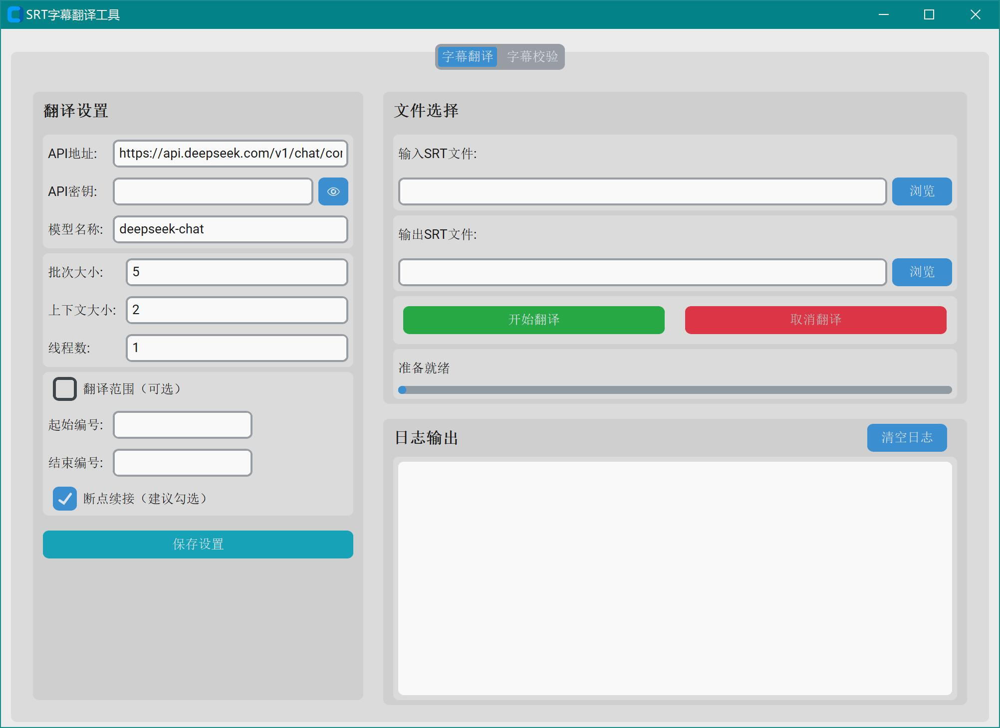

# SRT字幕翻译工具

基于AI大语言模型的SRT字幕翻译工具，支持**断点续接**、**多线程并发**、**批量处理**等特性。提供现代化GUI界面（仅Windows）和跨平台命令行工具。



## 🚀 Python环境使用

### 安装依赖
```bash
pip install customtkinter requests colorama
```

### GUI界面（Windows系统）
```bash
# 双击运行
run_gui.bat

# 或命令行启动
python srt_translator_gui.py
```

GUI默认使用**自定义API模式**，预设为DeepSeek服务地址。只需填入API密钥即可使用。支持所有OpenAI兼容模式的API服务。

### 命令行使用（跨平台）

#### 基本翻译命令
```bash
python srt_translator.py input.srt output_cn.srt --batch-size 30 --context-size 3 --threads 10
```

#### 完整参数说明
```bash
python srt_translator.py <输入文件> <输出文件> [选项]
```

**必需参数：**
- `输入文件`: 源SRT字幕文件路径
- `输出文件`: 翻译后的SRT文件保存路径

**重要选项：**
- `--api-key`: API密钥（必需，除非代码中设置了默认值）
- `--batch-size`: 每次翻译的字幕条数，建议30（越大翻译质量越好，速度也越快）
- `--context-size`: 上下文大小，建议3-5（越大翻译质量越好，提供更多前后文信息）
- `--threads`: 并发线程数，建议2-10（越大速度越快，但不建议超过10）

**API选择：**
- `--api deepseek`: 使用DeepSeek API
- `--api grok`: 使用Grok API  
- `--api custom`: 使用自定义OpenAI兼容API（推荐）
- `--api-endpoint`: 自定义API地址（与--api custom配合使用）
- `--model`: 指定模型名称（如deepseek-chat、gpt-4等）

**范围控制：**
- `--start`: 起始字幕编号（只翻译指定范围）
- `--end`: 结束字幕编号（与--start配合使用）
- `--no-resume`: 禁用断点续接，重新开始翻译

**其他选项：**
- `--terminology-file`: 自定义术语库文件路径（默认terminology.json）

#### 使用示例

**1. 使用DeepSeek翻译完整文件：**
```bash
python srt_translator.py movie.srt movie_cn.srt \
  --api deepseek \
  --api-key sk-你的密钥 \
  --batch-size 20 \
  --threads 5
```

**2. 使用自定义API（推荐）：**
```bash
python srt_translator.py input.srt output.srt \
  --api custom \
  --api-endpoint https://api.deepseek.com/v1/chat/completions \
  --api-key sk-你的密钥 \
  --model deepseek-chat \
  --batch-size 30 \
  --context-size 3 \
  --threads 10
```

**3. 翻译指定范围（测试用）：**
```bash
python srt_translator.py test.srt test_cn.srt \
  --start 1 --end 50 \
  --api-key sk-你的密钥
```

**4. 高质量翻译（速度较慢）：**
```bash
python srt_translator.py input.srt output.srt \
  --batch-size 30 \
  --context-size 5 \
  --threads 2 \
  --api-key sk-你的密钥
```

**5. 高速翻译（适中质量）：**
```bash
python srt_translator.py input.srt output.srt \
  --batch-size 50 \
  --context-size 3 \
  --threads 10 \
  --api-key sk-你的密钥
```

#### 字幕校验工具

翻译完成后，使用校验工具验证结果：

```bash
# 基本校验
python srt_checker.py --source original.srt --translated translated.srt

# 生成详细报告
python srt_checker.py \
  --source original.srt \
  --translated translated.srt \
  --report validation_report.txt
```

**校验内容包括：**
- ✅ 字幕条目数量一致性
- ✅ 时间码格式和匹配度  
- ✅ 字幕编号连续性
- ✅ 文件格式完整性
- ✅ 随机抽样内容展示

> **⚠️ 重要提醒**：翻译完成后**务必使用校验工具**进行完整性检查！如发现条目缺失：
> 1. **推荐方案**：使用`--start/--end`参数单独翻译缺失部分，再手动合并到最终文件
> 2. **简单方案**：删除所有临时文件（`*_progress*.json`、`*_batch*.srt`），重新翻译一遍

## 📦 打包为Windows绿色软件

```bash
# 1. 安装打包工具
pip install pyinstaller

# 2. 检查环境
python check_build_env.py

# 3. 执行打包
python build_exe.py
```

打包后在 `SRT翻译工具/` 目录下生成可直接运行的exe文件，无需Python环境。

## 🛠️ 开发者信息

### 项目结构
```
├── srt_translator.py          # 核心翻译引擎
├── srt_translator_gui.py      # Windows GUI界面
├── srt_checker.py             # 字幕校验工具
├── build_exe.py               # 打包脚本
├── check_build_env.py         # 环境检查
├── run_gui.bat                # GUI启动脚本
├── requirements.txt           # 依赖列表
└── terminology.json           # 术语库文件
```

### 核心特性
- **断点续接**: 翻译中断后自动从断点继续
- **多线程**: 支持并发翻译，显著提升速度
- **术语库**: 保持专业术语翻译一致性（`terminology.json`）
- **上下文感知**: 提供前后文提升翻译质量
- **格式保护**: 完整保留SRT时间码和格式
- **OpenAI兼容**: 支持所有OpenAI Chat Completions API格式的服务

## ❓ 常见问题

**Q: 翻译速度慢？**
A: 增加`--threads`和`--batch-size`参数，注意API调用限制。

**Q: 翻译质量不好？**
A: 增大`--batch-size`和`--context-size`，使用术语库。

**Q: 断点续接失败？**
A: 确保使用相同的输入输出路径，检查进度文件完整性。

**Q: GUI启动失败？**
A: 检查是否安装了所有依赖。

**Q: API调用失败？**
A: 验证API密钥有效性，检查网络连接和API服务状态。

**Q: 想用其他AI服务？**
A: 大部分AI服务都兼容OpenAI API格式，使用自定义API模式即可。

**Q: 如何设置API密钥？**
A: 可以通过`--api-key`参数传递，或在`srt_translator.py`文件中设置默认值。

**Q: 翻译后发现条目缺失怎么办？**
A: 先用校验工具确认缺失范围，然后用`--start/--end`单独翻译缺失部分，或删除临时文件重新翻译。

---

💡 **提示**: 首次使用建议先用小范围测试：`--start 1 --end 50`